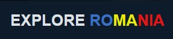
# Explore Romania

# Goal for this Project
Welcome to Explore Romania. Dive into Romania's captivating history, vibrant culture, must-visit attractions, and savory cuisine.

[Live Preview Of Explore Romania](https://xttrust.github.io/explore-romania/ "Live Preview")

Explore Romania is a website that offers insights into Romania's history, culture, rich cuisine, and top attractions. This project is tailored for tourists and anyone interested in learning more about Romania.

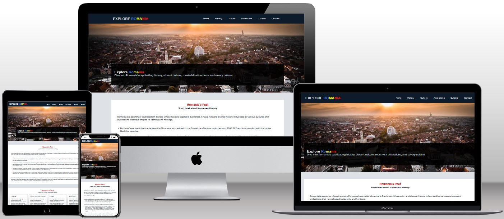

# Table of Contents
* [UX](#ux "UX")
    * [User Goals](#user-goals "User Goals")
    * [User Stories](#user-stories "User Stories")
    * [Site Owners Goals](#site-owners-goals)
    * [User Requirements and Expectations](#user-requirements-and-expectations)
         * [Requirements](#requirements)
         * [Expectations](#expectations)
     * [Design Choices](#design-choices)
        * [Fonts](#fonts)
        * [Icons](#icons)
        * [Colors](#colors)
        * [Structure](#structure)
    * [Wireframes](#wireframes)
    * [Features](#features)
        * [Existing Features](#existing-features)
            * [Navigation Bar](#navigation-bar)
            * [Welcome Section](#welcome-section)
            * [About Section](#about-section)
            * [History Section](#history-section)
            * [Culture Section](#culture-section)
            * [Attraction Section](#attraction-section)
            * [Culinary Section](#culinary-section)
            * [Contact Section](#contact-section)
            * [Footer](#footer)
        * [Features to be implemented](#features-to-be-implemented)
    * [Technologies used](#technologies-used)
        * [Languages](#languages)
        * [Tools and Libraries](#tools-and-libraries)
    * [Testing](#testing)
        * [Unfixed Bugs](#unfixed-bugs)
    * [Deployment](#deployment)
    * [Credits](#credits)

# UX

## User Requirements and Expectations

## User Goals
* Visually appealing, including images.
* Easily navigated around.
* Quality and valuable content.
* Easily found contact details.
## User Stories
* As a user, I want to learn more about Romania's history.
* As a user, I want to learn more about Romania's cuisine.
* As a user, I want to learn more about Romania's culture.
* As a user, I want to learn more about Romania's top attractions.
* As a user, I want to be able to easily contact the website.
* As a user, I want to be able to make contact with the website via several different methods, i.e. social media.
* As a user, I want to be able to easily navigate through the website.
## Site owners Goals
* Attract more visitors to Romania.
* Inform visitors about Romania's history, culture and cuisine.
* Inform visitors about the top attractions to visit.
* Increase rankings on search engines.
### Requirements
* Easy to navigate on various screen sizes.
* Clear and precise information about Romania.
* Simple methods of contacting the club.
* Visually appealing design.
### Expectations
* I expect all links to social media sites to be opened in a new tab.
* I expect all navigation links to work correctly.
* I expect screen size not to affect the quality of the website.
* I expect all information to be correct and accurate.

\
&nbsp;
[Back to Top](#table-of-contents)
\
&nbsp;

## Design Choices

### Fonts
In order to move away from the basic fonts available, I have used 
[Google Fonts](https://fonts.google.com/ "Google Fonts") to find a text that best suits the feel of the website. For the main text I have chosen [Montserrat](https://fonts.google.com/specimen/Montserrat?query=mon "Montserrat font") as I feel it is has a sharp, simple and easy to read look.
In order for headings to stand I have used ("Open Sans", sans-serif).

### Icons
As for icons I decided to use for my website [Font Awesome library](https://fontawesome.com/ "Font Awesome").

### Colors
As for colors I decided to use the same colors as the Romanian National flag. I have picked [Colorcombos](https://www.colorcombos.com/combomaker.html?design=cupcakes&output_width=100&size_option=element&colors=3A71C5,E9EB0A,E31616,DEE2E6,#FFFFFF,0D1B2A&background_color=FFFFFF&show_hex_flag=Y "colorcombos") to generate my own set of colors.

I will explain the uses of the various colors below, starting from top to bottom.

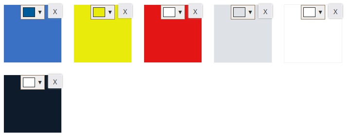

 
 * #3a71c5 - This color will be used for links and hover effects.
 * #e9eb0a - This colors will be used for borders and for styling the "Romania" word
 * #e31616 - This colors will be used for headings
 * #dee2e6 - This colors will be used for shadows, nav links, footer links, and text
 * #ffffff - This colors will be used for sections backgrounds
 * #0d1b2a - This colors will be used for background

### Structure
I will be building my website with a mobile first mindset using the iPhone 5/SE (320px) as the smallest screen size for styling to look good on. The screen size breakpoints that I will be using are from [Bootstrap breakpoints](https://getbootstrap.com/docs/5.0/layout/breakpoints/ "Bootstrap").

| Screen Size | Breakpoint |
| ----------- | ---------- |
| x-small     | <576px     |
| small       | => 576px   |
| medium      | => 768px   |
| large       | => 992px   |
| x-large     | => 1200px  |

\
&nbsp;
[Back to Top](#table-of-contents)
\
&nbsp;

# Wireframes
As for wireframes I have used [Balsamic](https://balsamiq.com/wireframes/ "Balsamic") for my website. I chose to use wireframes to visually plan and structure my website's layout and design, ensuring a user-friendly experience and consistent aesthetics across different device screens.

The wireframes are below:

### [Desktop Wireframe](wireframes/layout-desktop.png "Desktop wireframe")
### [Tablet Wireframe](wireframes/layout-tablet.png "Tablet wireframe")
### [Phone Wireframe](wireframes/layout-mobile.png "Phone wireframe")

\
&nbsp;
[Back to Top](#table-of-contents)
\
&nbsp;

# Features

## Existing Features

### Navigation Bar

The navigation bar is fully responsive. Since the navbar is static it provides to user a way to navigate the website very easy, making it a user-friendly

+ Desktop (>=992px)
\
&nbsp;
    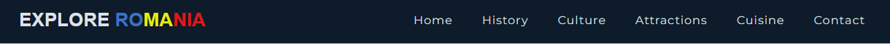

    -   To distinguish between active, clicked and hovered links, a blue hover effect is applied to the links, providing a visual indication when users interact with them.

    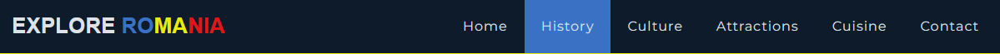

+ Small devices (<576px)
\
&nbsp;
    - The navbar becomes a hamburger-style menu when the width is <=576, maintaining full responsiveness

     \
    &nbsp;
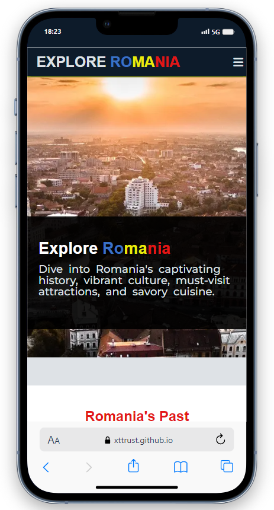

    - When pressed, it opens the main menu with all available links.

    \
    &nbsp;
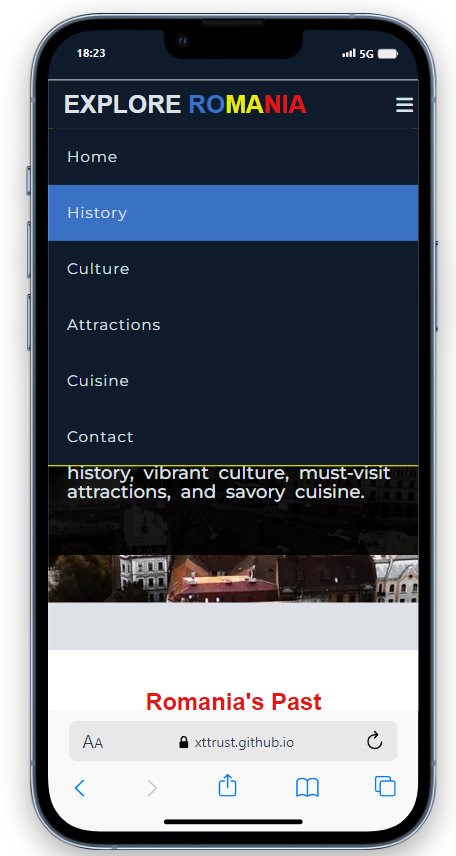

\
&nbsp;
[Back to Top](#table-of-contents)
\
&nbsp;

### Welcome Section
+ Welcome Section
    - In the welcome section, I've used a picture of "Oradea," a city in Romania, as the cover image.
    - This image offers users a sneak peek of some places in Romania.
    - The hero text consists of the website's name, "Explore Romania," followed by a brief description about the website.
    \
    &nbsp;

    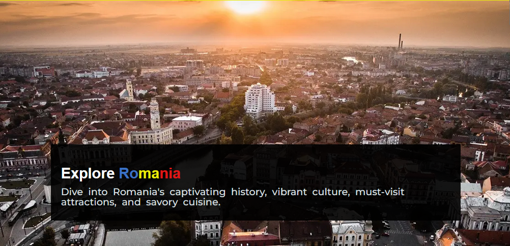

\
&nbsp;
[Back to Top](#table-of-contents)
\
&nbsp;

### History Section
+ History Section
    - In the history section, users will discover valuable insights into the rich and diverse history of Romania
    - The section provides a concise overview of Romania's historical timeline
    \
    &nbsp;
    - Desktop view

    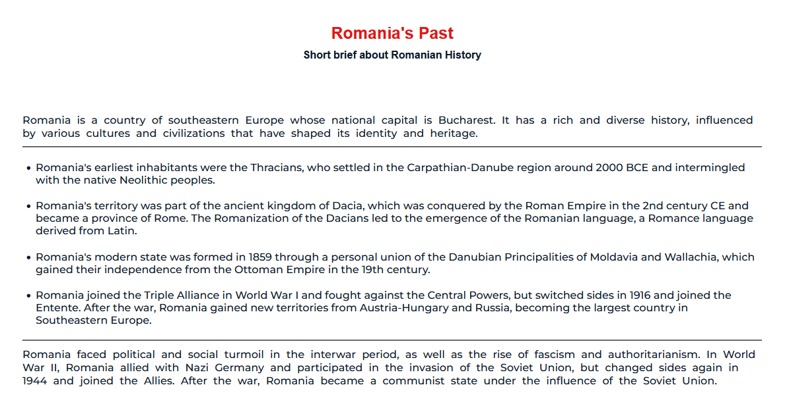
    \
    &nbsp;

    - Tablet view

    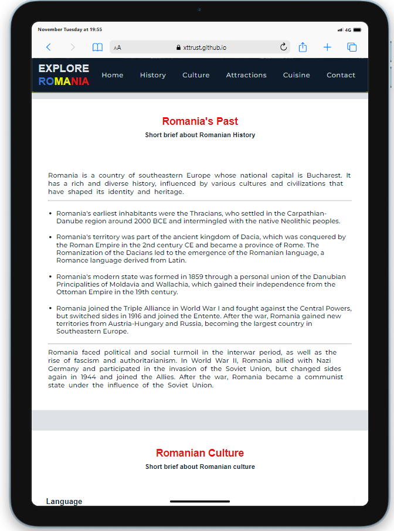
    \
    &nbsp;
    - Mobile view

    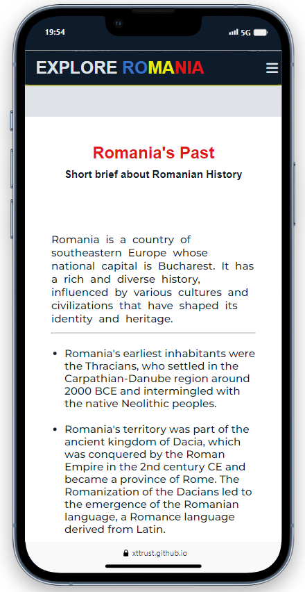
    \
    &nbsp;

\
&nbsp;
[Back to Top](#table-of-contents)
\
&nbsp;

### Culture Section
+ Culture Section
    - In the culture section, users will learn more about the language, folklore, religion and architecture of Romania
    \
    &nbsp;
    - Desktop view

    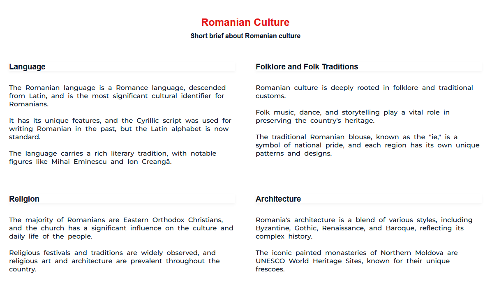
    \
    &nbsp;
    - Tablet view

    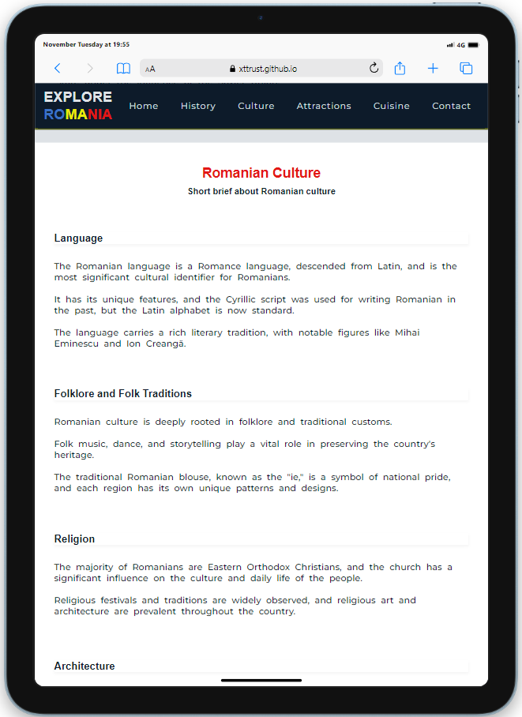
    \
    &nbsp;
    - Mobile view

    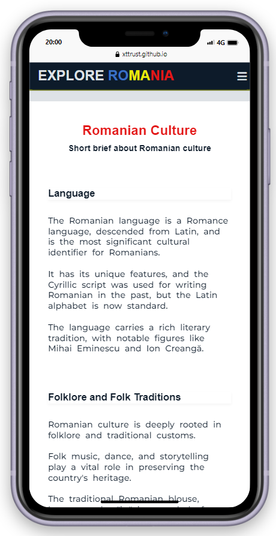
    \
    &nbsp;

\
&nbsp;
[Back to Top](#table-of-contents)
\
&nbsp;