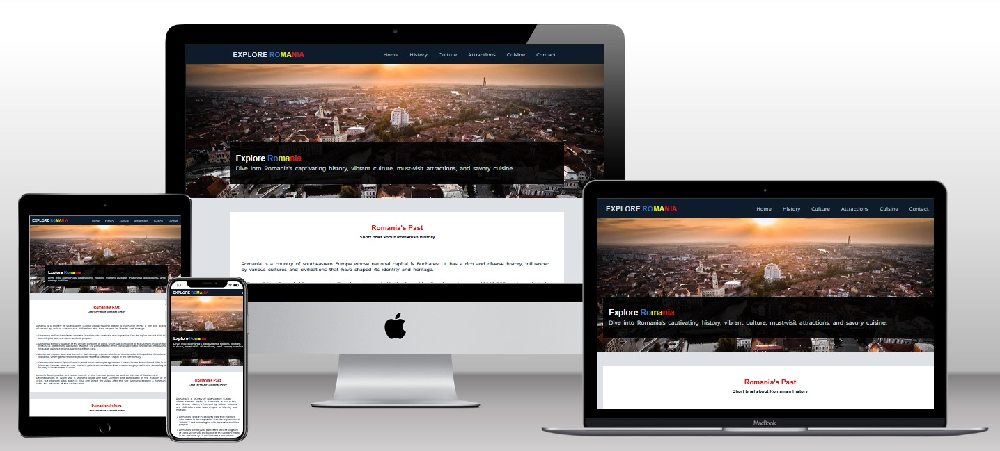
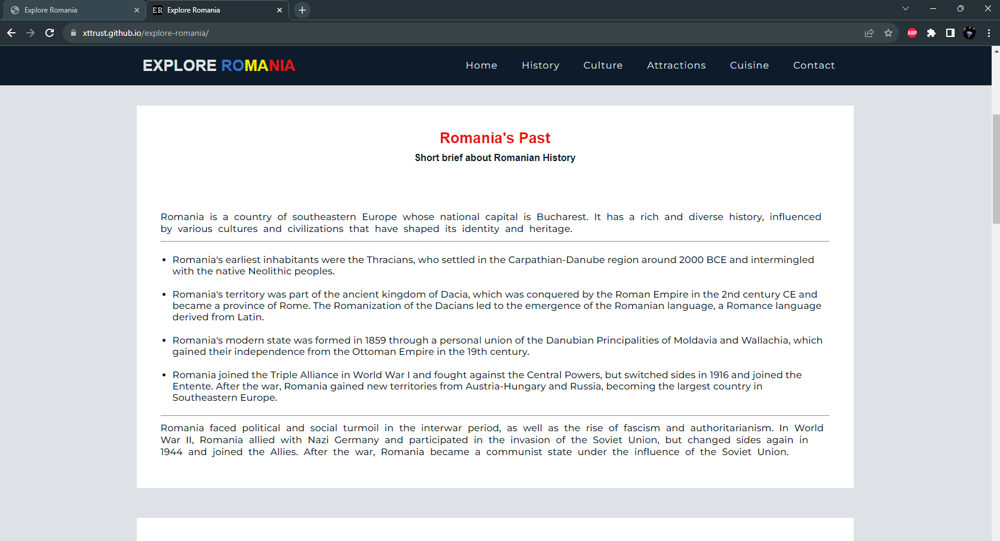
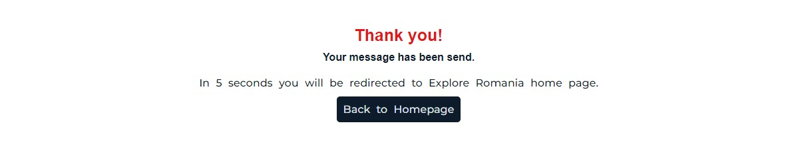

# Explore Romania

# Goal for this Project

Welcome to Explore Romania. Dive into Romania's captivating history, vibrant culture, must-visit attractions, and savory cuisine.

[Live Preview Of Explore Romania](https://xttrust.github.io/explore-romania/ "Live Preview")

Explore Romania is a website that offers insights into Romania's history, culture, rich cuisine, and top attractions. This project is tailored for tourists and anyone interested in learning more about Romania.



# Table of Contents

- [UX](#ux "UX")
  - [User Goals](#user-goals "User Goals")
  - [User Stories](#user-stories "User Stories")
  - [Site Owners Goals](#site-owners-goals)
  - [User Requirements and Expectations](#user-requirements-and-expectations)
    - [Requirements](#requirements)
    - [Expectations](#expectations)
  - [Design Choices](#design-choices)
    - [Fonts](#fonts)
    - [Icons](#icons)
    - [Colors](#colors)
    - [Structure](#structure)
- [Wireframes](#wireframes)
  - [Features](#features)
    - [Navigation Bar](#navigation-bar)
    - [Welcome Section](#welcome-section)
    - [History Section](#history-section)
    - [Culture Section](#culture-section)
    - [Attraction Section](#attraction-section)
    - [Cuisine Section](#cuisine-section)
    - [Contact Section](#contact-section)
    - [Footer](#footer)
    - [Thank You Page](#thank-you-page-form-submision-page)
    - [Features to be implemented](#features-to-be-implemented)
- [Technologies used](#technologies-used)
  - [Languages](#languages)
  - [Tools](#tools)
- [Testing](#testing)
  - [Unfixed Bugs](#unfixed-bugs)
- [Deployment](#deployment)
- [Refactor](#refactor)
- [Credits](#credits)

# UX

## User Requirements and Expectations

## User Goals

- Visually appealing, including images.
- Easily navigated around.
- Quality and valuable content.
- Easily found contact details.

## User Stories

- As a user, I want to learn more about Romania's history.
- As a user, I want to learn more about Romania's cuisine.
- As a user, I want to learn more about Romania's culture.
- As a user, I want to learn more about Romania's top attractions.
- As a user, I want to be able to easily contact the website.
- As a user, I want to be able to make contact with the website via several different methods, i.e. social media.
- As a user, I want to be able to easily navigate through the website.

## Site owners Goals

- Attract more visitors to Romania.
- Inform visitors about Romania's history, culture and cuisine.
- Inform visitors about the top attractions to visit.
- Increase rankings on search engines.

### Requirements

- Easy to navigate on various screen sizes.
- Clear and precise information about Romania.
- Simple method of contacting the website.
- Visually appealing design.

### Expectations

- I expect all links to social media sites to be opened in a new tab.
- I expect all navigation links to work correctly.
- I expect screen size not to affect the quality of the website.
- I expect all information to be correct and accurate.

\
&nbsp;
[Back to Top](#table-of-contents)
\
&nbsp;

## Design Choices

### Fonts

To diversify the font choices beyond the standard options, I've integrated [Google Fonts](https://fonts.google.com/ "Google Fonts") to find a typeface that complements the website's aesthetic. For the main text, I've opted for [Montserrat](https://fonts.google.com/specimen/Montserrat?query=mon "Montserrat font") due to its sharp, simple, and easily legible appearance. To make headings stand out, I've applied "Open Sans" with a sans-serif fallback.

### Icons

As for icons I decided to use for my website [Font Awesome library](https://fontawesome.com/ "Font Awesome").

### Colors

As for colors I decided to use the same colors as the Romanian National flag. I have picked [Colorcombos](https://www.colorcombos.com/combomaker.html?design=cupcakes&output_width=100&size_option=element&colors=3A71C5,E9EB0A,E31616,DEE2E6,#FFFFFF,0D1B2A&background_color=FFFFFF&show_hex_flag=Y "colorcombos") to generate my own set of colors.

I will explain the uses of the various colors below, starting from top to bottom.


- #3a71c5 - This color will be used for links and hover effects.
- #e9eb0a - This colors will be used for borders and for styling the "Romania" word
- #e31616 - This colors will be used for headings
- #dee2e6 - This colors will be used for shadows, nav links, footer links, and text
- #ffffff - This colors will be used for sections backgrounds
- #0d1b2a - This colors will be used for background

### Structure

My website development will follow a mobile-first strategy, focusing on creating a visually appealing design for smaller screens. Specifically, I'll begin styling for the iPhone 5, which has a width of 320px. To ensure responsiveness, I'll rely on the predefined screen size breakpoints provided by [Bootstrap](https://getbootstrap.com/docs/5.0/layout/breakpoints/ "Bootstrap").

| Screen Size | Breakpoint |
| ----------- | ---------- |
| x-small     | <576px     |
| small       | => 576px   |
| medium      | => 768px   |
| large       | => 992px   |
| x-large     | => 1200px  |

\
&nbsp;
[Back to Top](#table-of-contents)
\
&nbsp;

# Wireframes

I opted for [Balsamic](https://balsamiq.com/wireframes/ "Balsamic") for wireframing to visually structure and plan the layout and design of my website, aiming to provide a user-friendly experience and maintain design consistency across different devices.

The wireframes are below:

### [Desktop Wireframe](wireframes/layout-desktop.png "Desktop wireframe")

### [Tablet Wireframe](wireframes/layout-tablet.png "Tablet wireframe")

### [Phone Wireframe](wireframes/layout-mobile.png "Phone wireframe")

\
&nbsp;
[Back to Top](#table-of-contents)
\
&nbsp;

# Features

### Navigation Bar

The navigation bar is fully responsive. Since the navbar is fixed to the top it provides to user a way to navigate the website very easy, making it a user-friendly

- Desktop (>=992px)


- A blue hover effect is used to visually highlight active, clicked, and hovered links, making it clear to users when they are interacting with these elements.


- Small devices (<576px)

- When the screen width is less than or equal to 576 pixels, the navigation bar adopts a hamburger-style menu, maintaining responsiveness across all devices.


- When pressed, it opens the main menu with all available links.


[Back to Top](#table-of-contents)

### Welcome Section

- Welcome Section

  - In the welcome section, I've used a picture of "Oradea," a city in Romania, as the cover image.
  - This image offers users a sneak peek of some places in Romania.
  - The hero text consists of the website's name, "Explore Romania," followed by a brief description about the website.

  

[Back to Top](#table-of-contents)

### History Section

- History Section

  - In the history section, users will discover valuable insights into the rich and diverse history of Romania
  - The section provides a concise overview of Romania's historical timeline

  - Desktop view

  

  - Tablet view

  

  - Mobile view

  

[Back to Top](#table-of-contents)

### Culture Section

- Culture Section

  - In the culture section, users will learn more about the language, folklore, religion and architecture of Romania

  - Desktop view

  

  - Tablet view

  

  - Mobile view

  

[Back to Top](#table-of-contents)

### Attractions Section

- Attractions Section

  - In the attractions section, users will be presented with a collection of images showcasing some of Romania's most popular tourist destinations.

  - Desktop view

  

  - Tablet view

  

  - Mobile view

  

[Back to Top](#table-of-contents)

### Cuisine Section

- Cuisine Section

  - In the cuisine section, users will be presented with a collection of images showcasing some of Romania's most popular dishes.

  - Desktop view

  

  - Tablet view

  

  - Mobile view

  

[Back to Top](#table-of-contents)

### Contact Section

- Cuisine Section

  - In the contact section, users will be presented with a form where they can contact Explore Romania.

  - Desktop view

  

  - Tablet view

  

  - Mobile view

  

[Back to Top](#table-of-contents)

### Footer

- Footer

  - In the footer section, users will find external links to social media also a made by message.

  - Desktop view

  

  - Tablet view

  

  - Mobile view

  

[Back to Top](#table-of-contents)

### Thank You Page (Form submision page)

- In this page users will see a section with a thank you message and they will be redirected back to homepage after 5 seconds.

- View

  

## Features to be Implemented

- Cuisine section, the images should have the name of the food as watermark.
- History section, a link to Wikipedia to learn more about Romania and a documentary video about Romania.

[Back to Top](#table-of-contents)

# Technologies used

## Languages

- [HTML](https://en.wikipedia.org/wiki/HTML "HTML")
- [CSS](https://en.wikipedia.org/wiki/CSS "CSS")
- [Javascript](https://en.wikipedia.org/wiki/JavaScript "Javascript")

## Libraries & Frameworks

- [Google Fonts](https://fonts.google.com/ "Google Fonts")
- [Font Awesome library](https://fontawesome.com/ "Font Awesome")

## Tools

- [Balsamic](https://balsamiq.com/wireframes/ "Balsamic")
- [W3C HTML Validation Service](https://validator.w3.org/ "W3C HTML")
- [W3C CSS Validation Service](https://jigsaw.w3.org/css-validator/ "W3C CSS")
- [Colorcombos](https://www.colorcombos.com "colorcombos")
- [CSS Scan](https://getcssscan.com/css-box-shadow-examples "getcssscan.com")
- [Squoosh](https://squoosh.app/ "squoosh.app")

[Back to Top](#table-of-contents)

# Testing

- The website has met the objectives set by all parties involved. It's responsive on various screen sizes, ensuring clean and crisp images without excessive empty space. Users can easily navigate and contact us through the contact form or social media. The content is concise, and the design is uncluttered, providing a user-friendly experience.

- While testing I didn't encounter any errors with the final project.
- HTML (index.html) validator [results](wireframes/html-validate.jpg "W3C HTML")
- CSS validator [results](wireframes/css-validate.jpg "W3C CSS")

- The final project was tested using Google's Lighthouse on github pages. The results are below
- Performance test for Mobile:


- Performance test for Desktop:


- When testing on Google Chrome mobile version I didn't like the default browser theme color so I've customized the browser's theme color to match the website's theme, ensuring that everything looks just the way I prefer it.

```
<meta name="theme-color" content="#121A18">
```

- Using Mobile Simulator extension in Google Chrome I have tested the website on differite devices. Test results are listed below.

| Device                |     Test 1     |       Test 2 | Result Test 1 | Result Test 2 |
| --------------------- | :------------: | -----------: | ------------- | ------------- |
| Samsung Galaxy S20    | Responsiveness |  Attractions | Passed        | Passed        |
| Samsung Galaxy S21 FE | Responsiveness |  Menu Button | Passed        | Passed        |
| iPad Air 4            | Responsiveness |         Menu | Passed        | Passed        |
| Galaxy Tab S7         | Responsiveness |         Menu | Passed        | Passed        |
| iPhone 5              | Responsiveness |  Menu Button | Passed        | Passed        |
| iPhone X              | Responsiveness |      History | Passed        | Passed        |
| iPhone 11             | Responsiveness |      Cuisine | Passed        | Passed        |
| iPhone 12 Mini        | Responsiveness | Contact Form | Passed        | Passed        |
| iPhone 13 PRO         | Responsiveness |  Menu Button | Passed        | Passed        |
| Mackbook Air          | Responsiveness |         Menu | Passed        | Passed        |
| Desktop               | Responsiveness |    Thank You | Passed        | Passed        |
| Dell Latitude         | Responsiveness |         Menu | Passed        | Passed        |

## Bugs

- There are no bugs to fix in the final project

[Back to Top](#table-of-contents)

# Deployment

After writing the code, committing, and pushing it to GitHub, the project was deployed using GitHub by following these steps:

- Go to the repository on GitHub and click on **Settings**

- In the side navigation, select **Pages**

- In the **None** dropdown, choose **main**

- Click the **Save** button.

- The website is now live at `https://USERNAME.github.io/explore-romania/`

- If any changes are needed, you can make them, commit, and push to GitHub, and the updates will be reflected on the website.

[Back to Top](#table-of-contents)

# Refactor

After the refactor some of the design changed. See details below.

- The attractions section has a hover effect of a blue-box-shadow of 3px to distinguish from the others.


- In the cuisine section the images have a padding of 3px.


- To make the user experience and provide visual cues for the currently viewed section, I've incorporated a hover effect in the menu using scrollspy (Javascript). This idea was inspired by a video I watched on YouTube.


[Back to Top](#table-of-contents)

# Credits

For readme, help and advice,

- [Simen Daehlin](https://github.com/Eventyret "Simen Daehlin")

For navigation and footer:

- [Love Running Project](https://codeinstitute.net "Love Running Project")

For scroolspy

- [Mr. Web Designer](https://www.youtube.com/watch?v=fAAk9CATILc "Mr. Web Designer")

For images and content inspiration:

- [Chefspencil](https://www.chefspencil.com/top-10-romanian-foods/ "chefspencil.com")
- [Tripadvisor](https://tripadvisor.com/ "tripadvisor.com")

For Screen Size Breakpoint:

- [Bootstrap](https://getbootstrap.com/ "Bootstrap")

Images credits

- [Fabrice Florin](https://www.flickr.com/photos/fabola/ "Fabrice Florin")
- [Savori Urbane](savoriurbane.com "Savori Urbane")
- [Restaurant Sergiana](https://www.instagram.com/restaurantsergiana/ "restaurant sergiana")
- [Unica](https://retete.unica.ro/recipes/jumari-cu-bere/ "unica.ro")
- [Nitu Iulian](https://www.flickr.com/photos/26291296@N02/ "Nitu Iulian")
- [Laura Laurentiu](https://www.lauralaurentiu.ro/retete-culinare/aperitive/salata-de-boeuf-reteta-pas-cu-pas.html "lauralaurentiu.ro")
- [pixabay.com](https://pixabay.com "pixabay.com")

[Back to Top](#table-of-contents)
